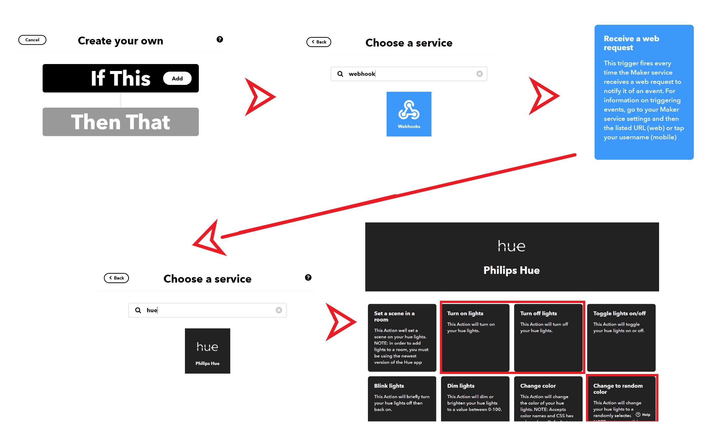

## Office Light Switch App
An app to control Phillip Hue lights in your house from a mobile app build with [Xamarin.Forms](https://xamarin.com/forms) for iOS, Android, and Windows.

## Setup


## IFTTT & Hues
1. Create a free [IFTTT account](https://ifttt.com).
2. Create applets in IFTTT. All applets will have a "Webhooks" service with the Receive a web request trigger. The name of the events will be `turn_on_office_light`, `turn_off_office_light`, and `change_office_color`.




3. During the setup process for Hues you will need to link your account and then choose the following actions:

* turn_on_office_light -> Turn on lights
* turn_off_office_light -> Turn off lights
* change_office_color -> Chagne to random color


## App Guided Walkthrough

### Open Solution

Open `OfficeControl.sln` in Visual Studio 2019 or Visual Studio 2019 for Mac.

### Add API Key

Get your API Key from IFTTT. Go to the [Webhooks](https://ifttt.com/maker_webhooks) page on IFTTT and click on `Documentation`. This will give you your API key.

Open `Constants.cs` and fill in:

```csharp
public const string APIKey = "ENTER_API_KEY"; 
```

### Add Buttons

Open `MainPage.xaml` to see the app's main UI.

Remove all contents from the page and add:

```xaml
<StackLayout>
	<Button Text="Turn on light" Clicked="ButtonOn_Clicked"/>
    <Button Text="Turn off light" Clicked="ButtonOff_Clicked"/>
    <Button Text="Change Color" Clicked="ButtonColor_Clicked"/>
</StackLayout>
```

### Add Click Events

In the "code behind" of the XAML in `MainPage.xaml.cs` add the following click handlers:

```csharp
private async void ButtonOn_Clicked(object sender, EventArgs e)
{

}

private async void ButtonOff_Clicked(object sender, EventArgs e)
{

}

private async void ButtonColor_Clicked(object sender, EventArgs e)
{

}
```

### Call APIs

Fill in the following code to turn on the light:
```csharp
try
{
    var client = new HttpClient();
    await client.GetAsync(turnOnUrl);
}
catch (Exception ex)
{
    await DisplayAlert("Error", ex.Message, "OK");
}
```

Fill in the following code to turn on the light:
```csharp
try
{
    var client = new HttpClient();
    await client.GetAsync(turnOffUrl);
}
catch (Exception ex)
{
    await DisplayAlert("Error", ex.Message, "OK");
}
```

Fill in the following code to change the color of the light
```csharp
try
{
    var client = new HttpClient();
    await client.GetAsync(changeColorUrl);
}
catch (Exception ex)
{
    await DisplayAlert("Error", ex.Message, "OK");
}
```

### Run App

Run the app on Windows, Android, or iOS.